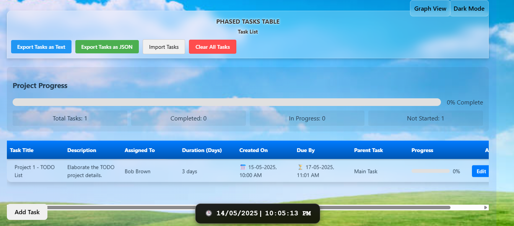

# Task Management Application

A React-based task management application built with Vite, featuring task creation, hierarchical dependencies, a dependency graph view, dark mode, import/export, and progress tracking with a responsive UI.

[](https://opensource.org/licenses/MIT)

## Table of Contents
- [Features](#features)
- [Screenshots](#screenshots)
- [Requirements](#requirements)
- [Setup](#setup)
- [Usage](#usage)
- [Project Structure](#project_structure)
- [Technologies](#technologies)
- [Contributing](#contributing)
- [License](#license)

## Features
- **Task Management**: Create, edit, delete, and organize tasks with fields for title, description, assignee, duration, dates, parent task, and progress.
- **Hierarchical Tasks**: Support parent-child relationships with expandable subtasks in table view.
- **Dependency Graph**: Visualize task dependencies using React Flow in a graph view.
- **Progress Tracking**: Monitor task progress (0-100%) and overall project progress with visual bars.
- **Import/Export**: Export tasks as JSON/text files and import from JSON.
- **Clear All Tasks**: Remove all tasks with a confirmation prompt.
- **Dark Mode**: Toggle between light/dark themes, saved in localStorage.
- **Responsive Design**: Includes animations (e.g., falling leaves) and cursor activity detection.
- **Local Storage**: Persist tasks and theme preferences with safe access handling.
- **Context Menu**: Right-click tasks to add subtasks.
- **Assignee Suggestions**: Autocomplete for assignee input from a predefined list.

## Screenshots
| Dashboard |
|-----------|
|  |

## Requirements
- Node.js (v16 or higher)
- npm or Yarn
- Git
- Web browser (e.g., Chrome, Firefox, Edge)

## Setup
1. Clone the repository:
   ```bash
   git clone https://github.com/johnkoshy/Phased-Tasks-Table.git
   cd Phased-Tasks-Table
   ```
2. Install dependencies:
   ```bash
   npm install
   # or
   yarn install
   ```
3. Start the development server:
   ```bash
   npm run dev
   # or
   yarn dev
   ```
   - Open `http://localhost:5173` in your browser.

## Usage
1. Access the app at `http://localhost:5173`.
2. Click **Add Task** to open the task form and fill in details (title, description, assignee, etc.).
3. Toggle between **Table View** (expandable subtasks) and **Graph View** (dependency nodes) using the view buttons.
4. Edit tasks by clicking **Edit** in table view or a node in graph view.
5. Delete tasks via the **Delete** button or clear all tasks with **Clear All Tasks**.
6. Export tasks as JSON/text or import from JSON using the respective buttons.
7. Toggle **Dark Mode** in the top-right corner.
8. Track progress with sliders in edit mode and view project statistics in table view.

## Project Structure
- **public/**:
  - **index.html**: Main HTML entry point.
  - **wallpaper.jpg**: Background image for light mode.
- **src/**:
  - **components/**: Reusable components (e.g., `TaskForm.js`, `TaskGraph.js`, `FooterClock.js`).
  - **App.js**: Main app component.
  - **App.css**: Global styles.
  - **index.js**: React entry point.
- **screenshots/**: Stores app screenshots.
- **vite.config.js**: Vite configuration for HMR and ESLint.
- **package.json**: Project dependencies and scripts.

## Technologies
- **React**: Frontend framework for UI.
- **Vite**: Build tool with Hot Module Replacement.
- **React Flow**: Library for dependency graph visualization.
- **localStorage**: Persists tasks and theme preferences.
- **ESLint**: Code linting for consistency.

## Contributing
Contributions are welcome! 🎉 Fork the repository, create a feature branch, and submit a pull request. For issues or suggestions, open an issue on [GitHub](https://github.com/johnkoshy/Phased-Tasks-Table/issues). Ensure code follows existing style and includes tests where applicable.

## License
This project is licensed under the [MIT License](LICENSE).